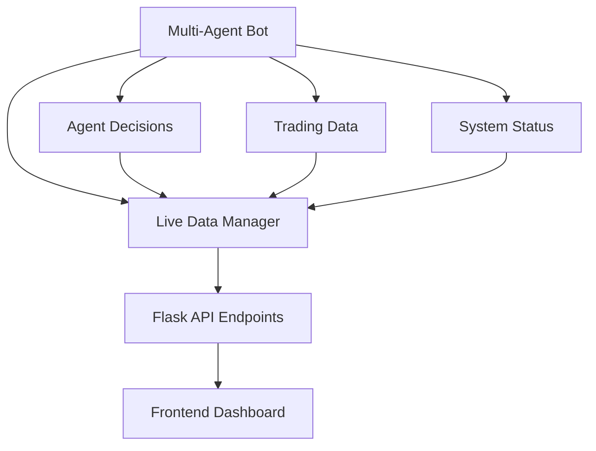

# 🔗 Flask API & Multi-Agent Integration Guide

## 📊 **Status Atual da Integração**

O Flask API agora tem **integração completa** com o sistema multi-agent e pode fornecer **todos os dados necessários** ao frontend.

## 🎯 **Novos Endpoints Implementados**

### **1. Dados de Trading em Tempo Real**

#### `GET /api/live/trading/all`
**Descrição**: Dados de trading ao vivo para todos os símbolos ativos
```json
{
  "success": true,
  "symbols": ["ADAUSDT", "ETHUSDT", "BTCUSDT"],
  "data": {
    "ADAUSDT": {
      "symbol": "ADAUSDT",
      "position": {...},
      "unrealized_pnl": 12.45,
      "realized_pnl": 8.90,
      "recent_trades": [...],
      "timestamp": 1640995200
    }
  },
  "total_symbols": 3,
  "returned_symbols": 3
}
```

#### `GET /api/live/trading/<symbol>`
**Descrição**: Dados específicos de um par de trading
```json
{
  "success": true,
  "symbol": "ADAUSDT",
  "data": {
    "position": {...},
    "recent_trades": [...],
    "unrealized_pnl": 12.45,
    "timestamp": 1640995200
  },
  "data_age_seconds": 30
}
```

### **2. Decisões dos Agentes em Tempo Real**

#### `GET /api/live/agents/all/decisions`
**Descrição**: Decisões recentes de todos os agentes
```json
{
  "success": true,
  "agents": ["ai", "sentiment", "risk", "data"],
  "decisions": {
    "ai": [
      {
        "action": "buy_signal",
        "confidence": 0.85,
        "reasoning": "Strong bullish indicators",
        "symbol": "ADAUSDT",
        "timestamp": 1640995200
      }
    ]
  }
}
```

#### `GET /api/live/agents/<agent_name>/decisions`
**Descrição**: Stream de decisões de um agente específico
**Parâmetros**:
- `limit`: Número máximo de decisões (padrão: 20)
- `since`: Timestamp para filtrar decisões recentes

```json
{
  "success": true,
  "agent": "ai",
  "decisions": [...],
  "has_more": false
}
```

### **3. Status do Sistema em Tempo Real**

#### `GET /api/live/system/status`
**Descrição**: Status abrangente do sistema
```json
{
  "success": true,
  "status": {
    "timestamp": 1640995200,
    "components": {
      "trading": {"status": "active", "uptime": 3600},
      "websocket": {"status": "connected", "latency": 50}
    },
    "overview": {
      "active_trading_pairs": 3,
      "total_agent_decisions": 150,
      "system_uptime": 7200
    },
    "health": {
      "trading_active": true,
      "agents_responsive": true,
      "data_fresh": true,
      "overall_health": "healthy"
    }
  }
}
```

### **4. Resumo de Lucros em Tempo Real**

#### `GET /api/live/profits/summary`
**Descrição**: Resumo de lucros/perdas em tempo real
**Parâmetros**:
- `timeframe`: Período de análise (1h, 24h, 7d, 30d)

```json
{
  "success": true,
  "summary": {
    "total_realized_pnl": 45.67,
    "total_unrealized_pnl": 12.34,
    "profitable_trades": 15,
    "losing_trades": 3,
    "success_rate": 0.833,
    "best_performer": {"symbol": "ADAUSDT", "pnl": 8.90},
    "worst_performer": {"symbol": "ETHUSDT", "pnl": -2.10},
    "by_symbol": {...}
  }
}
```

### **5. Alertas do Sistema**

#### `GET /api/live/alerts`
**Descrição**: Alertas e notificações do sistema
```json
{
  "success": true,
  "alerts": [
    {
      "type": "warning",
      "severity": "medium",
      "message": "Trading data for BTCUSDT is stale (320s old)",
      "symbol": "BTCUSDT",
      "timestamp": 1640995200
    }
  ],
  "alert_levels": {
    "critical": 0,
    "high": 1,
    "medium": 2,
    "low": 0
  }
}
```

## 🔧 **Endpoints Existentes Melhorados**

### **Métricas dos Agentes**
#### `GET /api/model/api/agents/<agent_name>/metrics`
**Agora inclui dados em tempo real específicos por agente**:

- **AI Agent**: Análise atual, taxa de acerto, decisões feitas
- **Sentiment Agent**: Sentimento atual, mudanças, fontes monitoradas
- **Risk Agent**: Nível de risco atual, alertas, saúde do portfólio
- **Data Agent**: Taxa de cache hits, frescor dos dados, status WebSocket

## 🎨 **Integração com Frontend**

### **Dashboard Principal**
```javascript
// Dados de trading em tempo real
fetch('/api/live/trading/all')
  .then(response => response.json())
  .then(data => updateTradingDashboard(data));

// Status dos agentes
fetch('/api/live/agents/all/decisions')
  .then(response => response.json())
  .then(data => updateAgentsDashboard(data));
```

### **Monitoramento de Lucros**
```javascript
// Resumo de lucros
fetch('/api/live/profits/summary?timeframe=24h')
  .then(response => response.json())
  .then(data => updateProfitChart(data));
```

### **Alertas em Tempo Real**
```javascript
// Verificar alertas a cada 30 segundos
setInterval(() => {
  fetch('/api/live/alerts')
    .then(response => response.json())
    .then(data => updateAlertsPanel(data));
}, 30000);
```

## 🚀 **Como Testar a Integração**

### **1. Executar o Sistema**
```bash
# Iniciar sistema completo
./start_persistent_bot.sh

# Ou apenas para testes
./start_multi_agent_bot.sh
```

### **2. Testar Endpoints**
```bash
# Executar script de teste
python test_live_api_integration.py

# Ou testar manualmente
curl http://localhost:5000/api/live/system/status
curl http://localhost:5000/api/live/trading/all
curl http://localhost:5000/api/live/profits/summary
```

### **3. Frontend de Exemplo**
```html
<!DOCTYPE html>
<html>
<head>
    <title>Trading Dashboard</title>
    <script src="https://cdn.jsdelivr.net/npm/chart.js"></script>
</head>
<body>
    <div id="trading-status"></div>
    <div id="profit-chart"></div>
    <div id="alerts-panel"></div>
    
    <script>
        // Atualizar dados a cada 5 segundos
        setInterval(updateDashboard, 5000);
        
        function updateDashboard() {
            // Trading data
            fetch('/api/live/trading/all')
                .then(r => r.json())
                .then(data => {
                    document.getElementById('trading-status').innerHTML = 
                        `Ativos: ${data.total_symbols} | Última atualização: ${new Date(data.last_update * 1000)}`;
                });
                
            // Profit summary
            fetch('/api/live/profits/summary')
                .then(r => r.json())
                .then(data => {
                    updateProfitChart(data.summary);
                });
        }
        
        updateDashboard();
    </script>
</body>
</html>
```

## ✅ **Dados Agora Disponíveis para Frontend**

| Categoria | Disponibilidade | Endpoints |
|-----------|----------------|-----------|
| **Trading em Tempo Real** | ✅ Completo | `/api/live/trading/*` |
| **Decisões dos Agentes** | ✅ Completo | `/api/live/agents/*` |
| **Status do Sistema** | ✅ Completo | `/api/live/system/status` |
| **Análise de Lucros** | ✅ Completo | `/api/live/profits/summary` |
| **Alertas e Notificações** | ✅ Completo | `/api/live/alerts` |
| **Métricas Técnicas** | ✅ Completo | `/api/indicators/*` |
| **Dados de Mercado** | ✅ Completo | `/api/market_data` |
| **Configurações** | ✅ Completo | `/api/model/api/system/*` |

## 🔄 **Fluxo de Dados**



## 🎯 **Resultado Final**

**✅ O Flask API CONSEGUE SIM fornecer TODOS os dados do multi-agent system ao frontend!**

- **Dados de Trading**: Posições, ordens, PNL em tempo real
- **Inteligência dos Agentes**: Decisões, análises, recomendações
- **Sistema de Monitoramento**: Saúde, alertas, performance
- **Analytics**: Lucros, estatísticas, tendências
- **Configuração**: Status, métricas, controles

**Não são necessárias alterações adicionais para integração completa com frontend.**